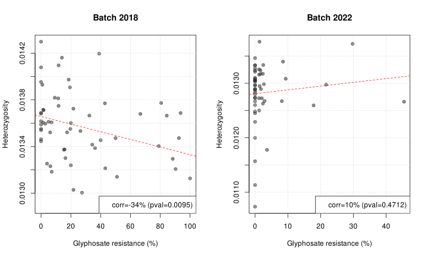
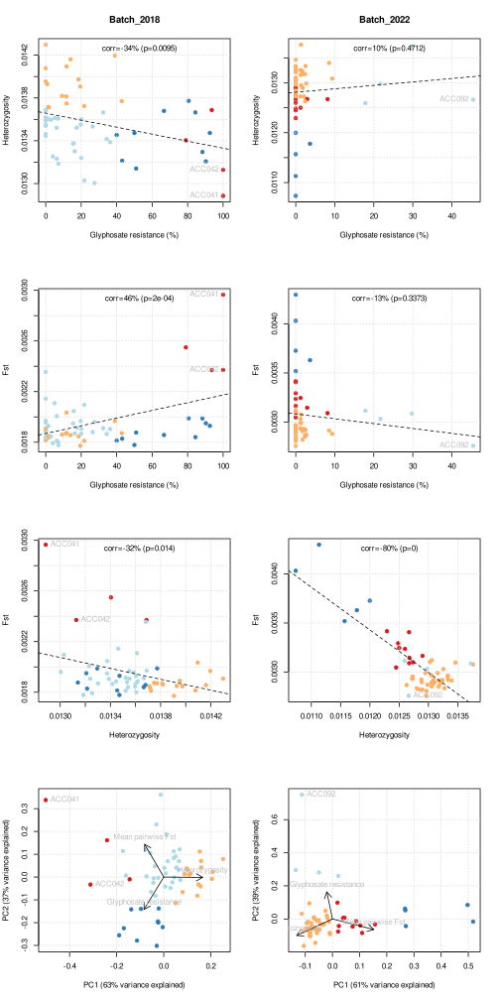
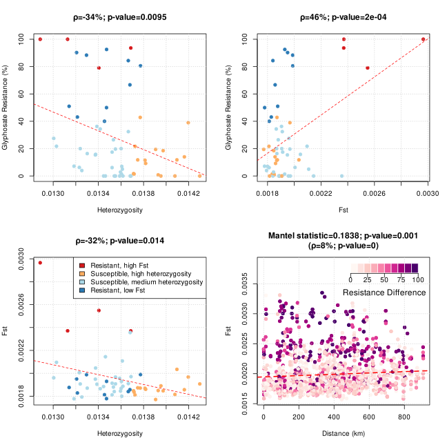
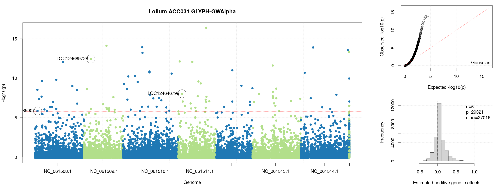
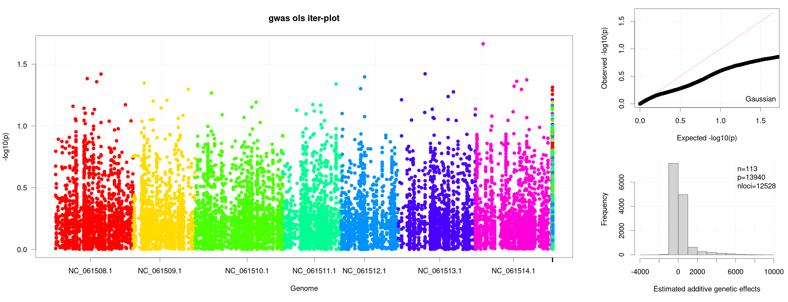
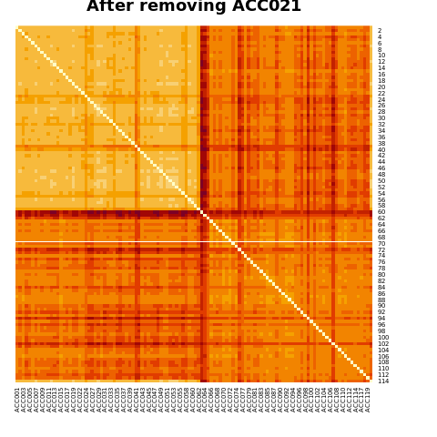

# What goes around comes around: the evolutionary quantitative genetics of glyphosate-resistant rigid ryegrass in Southeast Australia

Alternative titles: 
- Engineering a grounding halt for glyphosate resistance 
- Running glyphosate resistance aground
- Rounding down...


## Hypotheses:
1. After the first report of glyphosate resistance in Australia (and the world), resistance has not been controlled and is worsening.
2. Glyphosate resistance is polygenic, where resistance QTLs evolved from standing genetic variation and have been spreading across landscape.
3. We can use genomic prediction models to simulate resistance evolution to at least qualitatively identify actions which can be taken to reduce the development and spread of resistance.

These hypotheses roughly translate to answering the following questions:
1. What are the genetic and evolutionary bases of herbicide resistance in Lolium rigidum from SE Australia?
2. Are the genetic architectures truly polygenic or do major genes dominate?
3. Are the resistance alleles shared across populations?
4. What is the predominant source of herbicide resistance alleles, standing genetic variation or de novo mutations?

## Current state of glyphosate resistance in SE Australia

- Glyphosate resistance in SE Australia ranges from complete susceptibility to complete resistance.
- There is still more susceptible populations than resistant ones.
- There is significant north-to-south gradient in glyphosate resistance.
- There is significantly more resistant rigid ryegrass populations in the northern part of the landscape.
- There is no significant east-to-west resistance gradient.
- The latitude-wise gradient may be attributable to the differences in cropping patterns, i.e. more intensive grain cropping in the north, while mixed crop-pasture systems in the south.
- We can see an opportunity to control the spread of resistance through the movement of harvesting equipment from the early-harvesting northern regions to the later (higher rainfall) southern farm lands.

```R
dir = "/data-weedomics-1/weedomics/glyphosate_resistance_seau"
source(paste0(dir, "/src/kriging_and_maps.r"))
REGION = LOAD_AND_DEFINE_REGION()
MODELS = KRIGING_AND_LINEAR_MODELS(REGION)
colours = list(rdylgn=rev(c("#A50026","#D73027","#F46D43","#FDAE61","#FEE08B","#FFFFBF","#D9EF8B","#A6D96A","#66BD63","#1A9850","#006837")),
               spectral=rev(c("#9e0142","#d53e4f","#f46d43","#fdae61","#fee08b","#ffffbf","#e6f598","#abdda4","#66c2a5","#3288bd","#5e4fa2")),
               rdpu=c("#fff7f3","#fde0dd","#fcc5c0","#fa9fb5","#f768a1","#dd3497","#ae017e","#7a0177","#49006a"))
n_colours = 101
fname_map_svg_populations = paste0(dir, "/res/Glyphosate_resistance_distribution_SE_Australia_populations.svg")
fname_map_svg_gradient = paste0(dir, "/res/Glyphosate_resistance_distribution_SE_Australia_gradient.svg")
fname_svg = PLOT_DISTRIBUTION_MAP(REGION=REGION, MODELS=MODELS, fname_map_svg=fname_map_svg_populations, colours=colours[[1]], n_colours=n_colours, plot_points=TRUE, plot_krig=TRUE, rescale_krig=FALSE, hist_not_range=TRUE, label="Resistance (%)")
fname_svg = PLOT_DISTRIBUTION_MAP(REGION=REGION, MODELS=MODELS, fname_map_svg=fname_map_svg_gradient, colours=colours[[3]], n_colours=n_colours, plot_points=FALSE, plot_krig=TRUE, rescale_krig=TRUE, hist_not_range=FALSE, label="Mean Extrapolated Resistance (%)")
```


## Genetic diversity across SE Australia

Let's assess genetic differentiation between populations and genetic diversity across the landscape using Fst and $\theta_{\pi}$ estimated from genomewide Pool-seq data with minimum allele frequency (maf) set to zero.

- First, let's install poolgen:

```shell
dir="/data-weedomics-1/weedomics/glyphosate_resistance_seau/res"
cd $dir
git clone https://github.com/jeffersonfparil/poolgen.git
### Install cargo:
curl https://sh.rustup.rs -sSf | sh
source "$HOME/.cargo/env"
cd poolgen
cargo build --release
sudo ln -s ${dir}/poolgen/target/release/poolgen /usr/bin/poolgen
```

### Genetic relationships between populations using raw allele frequencies

- Convert allele counts into allele frequencies

```shell
dir="/data-weedomics-1/weedomics/glyphosate_resistance_seau/res"
cd $dir
time \
poolgen sync2csv \
    -f genotype_data_maf0.0.sync \
    -p phenotype_data.csv \
    --keep-p-minus-1 \
    --min-allele-frequency 0.0 \
    --min-coverage 10 \
    --n-threads 32 \
    -o genotype_data_maf0.0_cov10.csv
```

- Compute and plot the first 2 PCs of the allele frequency data

```R
dir="/data-weedomics-1/weedomics/glyphosate_resistance_seau/res"
setwd(dir)
### Load data
G = read.csv("genotype_data_maf0.0_cov10.csv")
# G = read.csv("genotype_data_maf0.001_cov10.csv")
X = t(as.matrix(G[, 4:ncol(G)]))
rownames(X) = colnames(G)[4:ncol(G)]
colnames(X) = paste(G$X.chr, G$pos, sep="-")
### Cluster and rotate
clustering = hclust(dist(X, method="euclidean"), method="average")
PCA = prcomp(t(X))
### Define batch 2018 and 2022 groups
vec_batches = c("Batch 2018", "Batch 2022")
vec_colours = c("red", "blue")
colour_tips = function(x) {
  if (is.leaf(x)) {
    acc = as.numeric(gsub("ACC", "", attr(x, "label")))
    attr(x, "nodePar") = list(lab.col=ifelse(acc <= 62, vec_colours[1], vec_colours[2]))
  }
  return(x)
}
### Prepare dendrogram and PCA biplot
dendro = dendrapply(as.dendrogram(clustering), colour_tips)
PC1_varex = PCA$sdev[1]*100 / sum(PCA$sdev)
PC2_varex = PCA$sdev[2]*100 / sum(PCA$sdev)
vec_colours_pca = rep(vec_colours[1], nrow(PCA$rotation))
vec_colours_pca[as.numeric(gsub("ACC", "", rownames(PCA$rotation))) > 62] = vec_colours[2]
### Plot
svg("PCA_biplot_allele_frequencies.svg", width=17, height=5)
# svg("PCA_biplot_allele_frequencies_maf0.001.svg", width=17, height=5)
layout(matrix(c(1,1,1,1,1,2,2,2), nrow=1))
par(mar=c(5, 5, 1, 1))
plot(dendro, main=""); grid()
legend("topright", legend=vec_batches, fill=vec_colours, cex=2)
par(mar=c(5, 5, 1, 1))
plot(PCA$rotation[,1:2], type="n",
       xlab=paste0("PC1 (", round(PC1_varex), "% variance explained)"),
       ylab=paste0("PC2 (", round(PC2_varex), "% variance explained)"))
grid()
points(x=PCA$rotation[,1], y=PCA$rotation[,2], pch=19, col=vec_colours_pca)
dev.off()
```


<!--  -->

### Pairwise Fst: genetic differentiation between populations

- Let's look at the pairwise Fst between populations. This also outputs Fst across non-overlapping sliding windows.

```shell
dir="/data-weedomics-1/weedomics/glyphosate_resistance_seau/res"
cd $dir
time \
poolgen fst \
    -f genotype_data_maf0.0.sync \
    -p phenotype_data.csv \
    --phen-name-col 0 \
    --phen-pool-size-col 1 \
    --phen-value-col 5 \
    --window-size-bp 100000 \
    --n-threads 32 \
    -o fst.csv
```

- Let's initially visually assess the pairwise Fst using a heatmap, a dendrogram and a PCA biplot to identify clusters
- There are two very distinct clusters explained by the two sequencing batches (2018 and 2022 sequencing experiments), where Batch 2018 shows less differentiation between populations than Batch 2022.
- Batch 2018 sequencing used Illumina's TruSeq protocol for library preparation, while Batch 2022 used NEBNext library preparation, and everything else are the same, i.e. same Qiagen DNeasy DNA extraction, and Illumina HiSeq X sequencing protocols.
- Now, let's try if one of the batches are less trustworthy than the other?
- _Lolium rigidum_ being an obligate outcrosser, we expected genetic differentiation to be higher.
- **One point to Batch 2022! (Potential explanation: I messed up with the library preparation of Batch 2018.)**

```R
dir = "/data-weedomics-1/weedomics/glyphosate_resistance_seau"
source(paste0(dir, "/src/data_loading_and_merging.r"))
setwd(paste0(dir, "/res"))
df = read.csv("fst.csv")
vec_pop = sort(df$X)
F = LOAD_KINSHIP_AND_SORT(population_names_sorted=vec_pop)
rownames(F) = colnames(F)

svg("Fst_heatmap.svg")
heatmap(F, revC=TRUE, Rowv=NA, Colv=NA, symm=TRUE, scale="none", main="Pairwise Fst")
dev.off()

vec_batches = c("Batch 2018", "Batch 2022")
vec_colours = c("red", "blue")
clustering = hclust(dist(F, method="euclidean"), method="average")
colour_tips = function(x) {
  if (is.leaf(x)) {
    acc = as.numeric(gsub("ACC", "", attr(x, "label")))
    attr(x, "nodePar") = list(lab.col=ifelse(acc <= 62, vec_colours[1], vec_colours[2]))
  }
  return(x)
}
dendro = dendrapply(as.dendrogram(clustering), colour_tips)
P = prcomp(F)
PC1_varex = P$sdev[1]*100 / sum(P$sdev)
PC2_varex = P$sdev[2]*100 / sum(P$sdev)
vec_colours_pca = rep(vec_colours[1], length(vec_pop))
vec_colours_pca[as.numeric(gsub("ACC", "", vec_pop)) > 62] = vec_colours[2]

svg("Fst_dendrogram_and_PCA.svg", width=17, height=5)
layout(matrix(c(1,1,1,1,1,2,2,2), nrow=1))
par(mar=c(5, 5, 1, 1))
plot(dendro, main=""); grid()
legend("topright", legend=vec_batches, fill=vec_colours, cex=2)
par(mar=c(5, 5, 1, 1))
plot(P$rotation[,1:2], type="n",
       xlab=paste0("PC1 (", round(PC1_varex), "% variance explained)"),
       ylab=paste0("PC2 (", round(PC2_varex), "% variance explained)"))
grid()
points(x=P$rotation[,1], y=P$rotation[,2], pch=19, col=vec_colours_pca)
dev.off()
```


### Pairwise Fst X geographic distances

- Let's see if as expected, populations are more genetically different the farther they are from each other per sequencing batch.
- Batch 2018 shows a slight yet significant positive correlation between genetic differentiation and distance!
- **One point to Batch 2018! (Potential explanation: The PCR enrichment step which NEBNext library preparation heavily relies on, more so than TruSeq, generates massive biases in the resulting allele counts.)**
- **It's a tie!** We will therefore perform subsequent analyses separately for each batch.

```R
if (system.file(package="vegan") == "") {
    install.packages("vegan")
}
dir = "/data-weedomics-1/weedomics/glyphosate_resistance_seau"
source(paste0(dir, "/src/data_loading_and_merging.r"))
source(paste0(dir, "/src/kriging_and_maps.r"))
setwd(paste0(dir, "/res"))
### Load and merge phenotypes and Fst
df_phenotype = LOAD_PHENOTYPES(fname_phenotype="phenotype_data.csv", batch="all", phenotype_names="Glyphosate")
fname_fst = "fst.csv"
list_df_phe_fst_and_mat_fst = MERGE_PHENOTYPE_AND_FST(df_phenotype=df_phenotype, fname_fst=fname_fst)
df_phe_fst = list_df_phe_fst_and_mat_fst$df_phe_fst
mat_fst = list_df_phe_fst_and_mat_fst$mat_fst
### Classify populations by sequencing batches (2018 via Illumina TruSeq library prep; 2022 via NEBNExt library prep)
idx_2018 = as.numeric(gsub("ACC", "", rownames(mat_fst))) <= 62
idx_2022 = as.numeric(gsub("ACC", "", rownames(mat_fst))) > 62
fst_min_2018 = min(mat_fst[idx_2018, idx_2018])
fst_max_2018 = max(mat_fst[idx_2018, idx_2018])
fst_mean_2018 = mean(mat_fst[idx_2018, idx_2018])
fst_sd_2018 = sd(mat_fst[idx_2018, idx_2018])
fst_min_2022 = min(mat_fst[idx_2022, idx_2022])
fst_max_2022 = max(mat_fst[idx_2022, idx_2022])
fst_mean_2022 = mean(mat_fst[idx_2022, idx_2022])
fst_sd_2022 = sd(mat_fst[idx_2022, idx_2022])
### Find the relationship between Fst and distance - where we hypothesise some significant positive relationship, i.e. populations which are farther apart are more differentiated.
vec_pop = df_phe_fst$X.Population
vec_pop1 = c()
vec_pop2 = c()
vec_dist = c()
vec_fst = c()
mat_dist = matrix(0.0, nrow=nrow(mat_fst), ncol=ncol(mat_fst))
for (i in 1:(length(vec_pop)-1)) {
    for (j in (i+1):length(vec_pop)) {
        # i=1; j=5
        pop1 = vec_pop[i]
        pop2 = vec_pop[j]
        d = HAVERSINE_DISTANCE_IN_KM(lat1=df_phe_fst$Latitude[df_phe_fst$X.Population==pop1], lon1=df_phe_fst$Longitude[df_phe_fst$X.Population==pop1], lat2=df_phe_fst$Latitude[df_phe_fst$X.Population==pop2], lon2=df_phe_fst$Longitude[df_phe_fst$X.Population==pop2])
        fst = df_phe_fst[df_phe_fst$X.Population==pop1, colnames(df_phe_fst)==pop2]
        vec_pop1 = c(vec_pop1, pop1)
        vec_pop2 = c(vec_pop2, pop2)
        vec_dist = c(vec_dist, d)
        vec_fst = c(vec_fst, fst)
        mat_dist[i, j] = d
        mat_dist[j, i] = d
    }
}
svg("Fst_and_distance_correlation.svg", width=12, height=6)
idx_2018 = (as.numeric(gsub("ACC", "", vec_pop1)) <= 62) & (as.numeric(gsub("ACC", "", vec_pop2)) <= 62)
idx_2022 = (as.numeric(gsub("ACC", "", vec_pop1)) > 62) & (as.numeric(gsub("ACC", "", vec_pop2)) > 62)
idx_2018_mat = as.numeric(gsub("ACC", "", vec_pop)) <= 62
idx_2022_mat = as.numeric(gsub("ACC", "", vec_pop)) > 62
par(mfrow=c(1,2))
corr_2018 = cor.test(vec_dist[idx_2018], vec_fst[idx_2018])
corr_2022 = cor.test(vec_dist[idx_2022], vec_fst[idx_2022])
### Mantel test (i.e. bootstrapped/repeated/Monte Carlo correlations)
# F_2018 = as.dist(mat_fst[idx_2018_mat, idx_2018_mat])
# D_2018 = as.dist(mat_dist[idx_2018_mat, idx_2018_mat])
F_2018 = as.dist(scale(mat_fst[idx_2018_mat, idx_2018_mat], scale=T, center=T))
D_2018 = as.dist(scale(mat_dist[idx_2018_mat, idx_2018_mat], scale=T, center=T))
mantel_2018 = vegan::mantel(F_2018, D_2018, method="pearson", permutations=1000)
F_2022 = as.dist(scale(mat_fst[idx_2022_mat, idx_2022_mat], scale=T, center=T))
D_2022 = as.dist(scale(mat_dist[idx_2022_mat, idx_2022_mat], scale=T, center=T))
mantel_2022 = vegan::mantel(F_2022, D_2022, method="pearson", permutations=1000)
plot(vec_dist[idx_2018], vec_fst[idx_2018],
     main=paste0("Batch 2018\n(npop=", sum(as.numeric(gsub("ACC", "", vec_pop)) <= 62), ")"),
     xlab="Distance (km)", ylab="Fst",
     pch=19, col=rgb(0.8, 0.8, 0.8, alpha=0.5))
grid()
abline(lm(vec_fst[idx_2018] ~ vec_dist[idx_2018]), col="red", lty=2, lwd=2)
legend("topright", legend=c(paste0("corr=", round(corr_2018$estimate*100), "% (pval=", round(corr_2018$p.value, 4), ")"),
                            paste0("Mantel satistic r=", round(mantel_2018$statistic, 2), " (pval=", round(mantel_2018$signif, 4), ")")))
plot(vec_dist[idx_2022], vec_fst[idx_2022],
     main=paste0("Batch 2022\n(npop=", sum(as.numeric(gsub("ACC", "", vec_pop)) > 62), ")"),
     xlab="Distance (km)", ylab="Fst",
     pch=19, col=rgb(0.8, 0.8, 0.8, alpha=0.5))
grid()
abline(lm(vec_fst[idx_2022] ~ vec_dist[idx_2022]), col="red", lty=2, lwd=2)
legend("topright", legend=c(paste0("corr=", round(corr_2022$estimate*100), "% (pval=", round(corr_2022$p.value, 4), ")"),
                            paste0("Mantel satistic r=", round(mantel_2022$statistic, 2), " (pval=", round(mantel_2022$signif, 4), ")")))
dev.off()
```


### $\theta_{\pi}$: genetic diversity or heterozygosity per population

- Now, we want to estimate genome-wide heterozygosities ($\theta_{\pi}$ where $\theta_{\pi} = 4N_{e}\mu$) per population and pairwise Fst. Both population statistics will be estimated as the mean across all genotyped sites, and means across 1 kb windows.
- The distribution of glyphosate resistance negatively correlates with heterozygosity or genetic diversity ($\rho$=0.26; pvalue=0.004).
- This negative relationship is expected as we can expect loss of diversity as selection (glyphosate application) forces the population through a severe bottleneck.
- **Point to Batch 2018: Batch 2018 - 2 points; Batch 2022 - 1 point.**

```shell
time \
poolgen heterozygosity \
    -f genotype_data_maf0.0.sync \
    -p phenotype_data.csv \
    --phen-name-col 0 \
    --phen-pool-size-col 1 \
    --phen-value-col 5 \
    --window-size-bp 1000 \
    --n-threads 32 \
    -o heterozygosity.csv
```

Plot heterozygosities across the landscape:

```R
dir = "/data-weedomics-1/weedomics/glyphosate_resistance_seau"
source(paste0(dir, "/src/data_loading_and_merging.r"))
source(paste0(dir, "/src/kriging_and_maps.r"))
setwd(paste0(dir, "/res"))

df_phe = LOAD_PHENOTYPES(fname_phenotype="phenotype_data.csv", batch="all", phenotype_names="Glyphosate")
df_het = read.csv("heterozygosity.csv")
df_het = df_het[,c(1, 2)]
colnames(df_het) = c("X.Population", "Heterozygosity")
df_out_het = merge(df_phe, df_het, by="X.Population")
df_out_het$Heterozygosity_untransformed = df_out_het$Heterozygosity
### Distribution of heterozygosity across the landscape
for (batch in c(2018, 2022)) {
    # batch = c(2018, 2022)[1]
    if (batch == 2018) {
        idx = as.numeric(gsub("ACC", "", df_out_het$X.Population)) < 63
    } else {
        idx = as.numeric(gsub("ACC", "", df_out_het$X.Population)) > 62
    }
    df_sub = df_out_het[idx, ]
    het_min = min(df_sub$Heterozygosity)
    het_max = max(df_sub$Heterozygosity)
    df_sub$Heterozygosity = 100 * (df_sub$Heterozygosity_untransformed - het_min) / (het_max-het_min)
    fname_csv_out = paste0("heterozygosity_with_geocoordinates-batch_", batch, ".csv")
    write.table(df_sub, file=fname_csv_out, sep=",", quote=FALSE, row.names=FALSE, col.names=TRUE)
    REGION = LOAD_AND_DEFINE_REGION(fname_region_kml="landscape.kml",
                                    fname_phenotype=fname_csv_out,
                                    herbicide="Heterozygosity",
                                    n_point_samples=1e4)
    MODELS = KRIGING_AND_LINEAR_MODELS(REGION)
    fname_map_svg = paste0("Heterozygosity_distribution_SE_Australia_batch-", batch, ".svg")
    n_colours = 101
    fname_svg = PLOT_DISTRIBUTION_MAP(REGION=REGION,
                                    MODELS=MODELS,
                                    fname_map_svg=fname_map_svg,
                                    label=paste0("Scaled heterozygosity (min=", round(het_min,4), "; max=", round(het_max,4), ")"),
                                    colours=rev(c("#9e0142","#d53e4f","#f46d43","#fdae61","#fee08b","#ffffbf","#e6f598","#abdda4","#66c2a5","#3288bd","#5e4fa2")),
                                    n_colours=n_colours,
                                    plot_points=FALSE, plot_krig=TRUE, rescale_krig=TRUE, hist_not_range=TRUE)
}
### Correlation between heterozygosity and glyphosate resistance
svg("Heterozygosity_and_glyphosate_resistance_correlation.svg", width=10, height=6)
idx_2018 = as.numeric(gsub("ACC", "", df_out_het$X.Population)) < 63
idx_2022 = as.numeric(gsub("ACC", "", df_out_het$X.Population)) > 62
par(mfrow=c(1, 2))
for (idx in list(idx_2018, idx_2022)) {
    if (sum(idx)==sum(idx_2018)) {
        title="Batch 2018"
    } else {
        title="Batch 2022"
    }
    plot(x=df_out_het$Glyphosate[idx], y=df_out_het$Heterozygosity_untransformed[idx],
        pch=19,
        col=rgb(0.1, 0.1, 0.1, alpha=0.5),
        xlab="Glyphosate resistance (%)",
        ylab="Heterozygosity",
        main=title)
    grid()
    # text(x=df_out_het$Glyphosate, y=df_out_het$Heterozygosity, lab=df_out_het$X.Population, pos=3, cex=0.75)
    abline(lm(Heterozygosity_untransformed ~ Glyphosate, data=df_out_het[idx, ]), col="red", lty=2)
    CORRELATION_BETWEEN_GLY_AND_HET = cor.test(df_out_het$Glyphosate[idx], df_out_het$Heterozygosity_untransformed[idx])
    legend("bottomright", legend=paste0("corr=", round(CORRELATION_BETWEEN_GLY_AND_HET$estimate*100), "% (pval=", round(CORRELATION_BETWEEN_GLY_AND_HET$p.value, 4), ")"))
}
dev.off()
```




### Glyphosate resistance X Fst X heterozygosity

- We hypothesise that we have 4 types of populations:

|                    | Suceptible | Resistant |
|--------------------|:----------:|:---------:|
| **High diversity** | g1 | g2 |
| **Low diversity**  | g3 | g4 |

- Let's force 4 groupings for our populations using glyphosate resistance, heterozygosity, and pairwise Fst averaged across all population combinations per population.
- The expected trends for batch 2018 holds true, i.e. decreasing diversity and increasing pairwise Fst as the population gets more glyphosate resistant.
- However, looking more closely at batch 2022, it becomes clear that these trends may not be easily identifiable because of the limited phenotype variation present in this batch - maximum resistance observed was only ~40% compared with 100% in batch 2018.
- We are therefore kind of back to where we started but with the knowledge that we should 

```R
dir = "/data-weedomics-1/weedomics/glyphosate_resistance_seau"
source(paste0(dir, "/src/data_loading_and_merging.r"))
setwd(paste0(dir, "/res"))

df_phe = LOAD_PHENOTYPES(fname_phenotype="phenotype_data.csv", batch="all", phenotype_names="Glyphosate")
df_phenotype = LOAD_PHENOTYPES(fname_phenotype="phenotype_data.csv", batch="all", phenotype_names="Glyphosate")
fname_fst = "fst.csv"
list_df_phe_fst_and_mat_fst = MERGE_PHENOTYPE_AND_FST(df_phenotype=df_phenotype, fname_fst=fname_fst)
df_phe_fst = list_df_phe_fst_and_mat_fst$df_phe_fst
df_het = read.csv("heterozygosity.csv")
df_het = df_het[,c(1, 2)]
colnames(df_het) = c("X.Population", "Heterozygosity")
df = merge(df_phe_fst, df_het, by="X.Population")

### Analyse per sequencing batch
idx_2018 = as.numeric(gsub("ACC", "", df$X.Population)) < 63
idx_2022 = as.numeric(gsub("ACC", "", df$X.Population)) > 62
list_idx = list(idx_2018, idx_2022)
vec_batch_names = c("Batch_2018", "Batch_2022")

svg("Clustering_populations_based_on_glyphosate_resistance_pi_and_fst.svg", width=7, height=14)
layout(matrix(c(1,5,2,6,3,7,4,8), ncol=2, byrow=TRUE))
for (i in 1:length(list_idx)) {
    idx = list_idx[[i]]
    mat_fst = list_df_phe_fst_and_mat_fst$mat_fst[idx, idx]
    df_sub = data.frame(X.Population=df$X.Population[idx],
                    Glyphosate=df$Glyphosate[idx],
                    Heterozygosity=df$Heterozygosity[idx],
                    Fst=rowMeans(mat_fst))
    # df_sub = df_sub[df_sub$Glyphosate <= 47, ]
    ### Extract glyphosate resistance, genetic diversity and fst
    X = scale(as.matrix(cbind(df_sub$Glyphosate, df_sub$Heterozygosity, df_sub$Fst)), center=TRUE, scale=TRUE)
    colnames(X) = c("Glyphosate resistance", "Heterozygosity", "Mean pairwise Fst")
    rownames(X) = df_sub$X.Population
    ### Force 4 cluster
    k = 4
    set.seed(123)
    clustering = kmeans(X, centers=k, iter.max=1e5)
    # colours_clusters = rainbow(k)
    colours_clusters = c("#d7191c", "#fdae61", "#abd9e9", "#2c7bb6")
    ### PCA
    P = prcomp(t(X))
    PC1_varex = P$sdev[1]*100 / sum(P$sdev)
    PC2_varex = P$sdev[2]*100 / sum(P$sdev)
    ### Plot
    idx_resist = df_sub$Glyphosate >= max(df_sub$Glyphosate) - 5
    idx_suscep = df_sub$Glyphosate == 0
    plot(x=df_sub$Glyphosate, y=df_sub$Heterozygosity, pch=19, xlab="Glyphosate resistance (%)", ylab="Heterozygosity", col=colours_clusters[clustering$cluster], main=vec_batch_names[i]); grid()
    abline(lm(Heterozygosity ~ Glyphosate, data=df_sub), lty=2, col+"gray")
    text(x=df_sub$Glyphosate[idx_resist], y=df_sub$Heterozygosity[idx_resist], lab=df_sub$X.Population[idx_resist], pos=2, col="gray")
    corr = cor.test(df_sub$Heterozygosity, df_sub$Glyphosate)
    legend("top", legend=paste0("corr=", round(100*corr$estimate), "% (p=", round(corr$p.value, 4), ")"), bty="n")
    plot(x=df_sub$Glyphosate, y=df_sub$Fst, pch=19, xlab="Glyphosate resistance (%)", ylab="Fst", col=colours_clusters[clustering$cluster]); grid()
    abline(lm(Fst ~ Glyphosate, data=df_sub), lty=2, col+"gray")
    text(x=df_sub$Glyphosate[idx_resist], y=df_sub$Fst[idx_resist], lab=df_sub$X.Population[idx_resist], pos=2, col="gray")
    corr = cor.test(df_sub$Fst, df_sub$Glyphosate)
    legend("top", legend=paste0("corr=", round(100*corr$estimate), "% (p=", round(corr$p.value, 4), ")"), bty="n")
    plot(x=df_sub$Heterozygosity, y=df_sub$Fst, pch=19, xlab="Heterozygosity", ylab="Fst", col=colours_clusters[clustering$cluster]); grid()
    abline(lm(Fst ~ Heterozygosity, data=df_sub), lty=2, col+"gray")
    text(x=df_sub$Heterozygosity[idx_resist], y=df_sub$Fst[idx_resist], lab=df_sub$X.Population[idx_resist], pos=4, col="gray")
    corr = cor.test(df_sub$Fst, df_sub$Heterozygosity)
    legend("top", legend=paste0("corr=", round(100*corr$estimate), "% (p=", round(corr$p.value, 4), ")"), bty="n")
    plot(P$rotation[,1:2], type="n", xlab=paste0("PC1 (", round(PC1_varex), "% variance explained)"), ylab=paste0("PC2 (", round(PC2_varex), "% variance explained)")); grid()
    points(x=P$rotation[,1], y=P$rotation[,2], pch=19, col=colours_clusters[clustering$cluster])
    text(x=P$rotation[idx_resist,1], y=P$rotation[idx_resist,2], lab=rownames(X)[idx_resist], pos=4, col="gray")
    # text(x=P$rotation[idx_suscep,1], y=P$rotation[idx_suscep,2], lab=rownames(X)[idx_suscep], pos=4, col="gray")
    ### eigen vec
    V = scale(P$x[,1:2], center=TRUE, scale=TRUE)
    for (eigenvec in colnames(X)) {
        idx_ = rownames(V)==eigenvec
        arrows(x0=0, y0=0, colMeans(x1)=V[idx_, 1]/7, y1=V[idx_, 2]/7, length=0.1)
        text(x=V[idx_, 1]/7, y=V[idx_, 2]/7, lab=eigenvec, pos=3, col="gray")
    }
}
dev.off()
```



- Focusing on the trends which make sense, i.e. using only Batch 2018 dataset:

```R
dir = "/data-weedomics-1/weedomics/glyphosate_resistance_seau"
source(paste0(dir, "/src/data_loading_and_merging.r"))
source(paste0(dir, "/src/kriging_and_maps.r"))
setwd(paste0(dir, "/res"))
### Load data
df_phe = LOAD_PHENOTYPES(fname_phenotype="phenotype_data.csv", batch="all", phenotype_names="Glyphosate")
df_phenotype = LOAD_PHENOTYPES(fname_phenotype="phenotype_data.csv", batch="all", phenotype_names="Glyphosate")
fname_fst = "fst.csv"
list_df_phe_fst_and_mat_fst = MERGE_PHENOTYPE_AND_FST(df_phenotype=df_phenotype, fname_fst=fname_fst)
df_phe_fst = list_df_phe_fst_and_mat_fst$df_phe_fst; write.table(df_phe_fst, file="fst-phen-coor.csv", row.names=F, quote=FALSE, sep=",")
df_het = read.csv("heterozygosity.csv")
df_het = df_het[,c(1, 2)]
colnames(df_het) = c("X.Population", "Heterozygosity")
### Merge and filter data
df = merge(df_phe_fst, df_het, by="X.Population")
idx = as.numeric(gsub("ACC", "", df$X.Population)) < 63
mat_fst = list_df_phe_fst_and_mat_fst$mat_fst[idx, idx]
df = data.frame(X.Population=df$X.Population[idx],
                Latitude=df$Latitude[idx],
                Longitude=df$Longitude[idx],
                Glyphosate=df$Glyphosate[idx],
                Heterozygosity=df$Heterozygosity[idx],
                Fst=rowMeans(mat_fst))
### Force 4 clusters
k = 4
set.seed(123)
clustering = kmeans(scale(as.matrix(cbind(df$Glyphosate, df$Heterozygosity, df$Fst)), center=TRUE, scale=TRUE),
                    centers=k, iter.max=1e5)
colours_clusters = c("#d7191c", "#fdae61", "#abd9e9", "#2c7bb6")

### Plot
svg("Fst_heterozygosity_and_glyphosate_resistance.svg", width=9, height=9)
layout(matrix(c(1,2,3,4), byrow=TRUE, nrow=2))
###############################
### Diversity vs resistance ###
mod = lm(Glyphosate ~ Heterozygosity, data=df)
corr = cor.test(df$Heterozygosity, df$Glyphosate)
plot(x=df$Heterozygosity, y=df$Glyphosate, xlab="Heterozygosity", ylab="Glyphosate Resistance (%)",
     type="p", pch=19, col=colours_clusters[clustering$cluster],
     main=paste0("ρ=", round(corr$estimate*100), "%; p-value=", round(corr$p.value,4)))
grid()
abline(mod, lty=2, col="red")
### Fst vs resistance
df$Fst = df$Fst * 1e3
mod = lm(Glyphosate ~ Fst, data=df)
corr = cor.test(df$Fst, df$Glyphosate)
plot(x=df$Fst, y=df$Glyphosate, xlab="Fst (×10⁻³)", ylab="Glyphosate Resistance (%)",
     type="p", pch=19, col=colours_clusters[clustering$cluster],
     main=paste0("ρ=", round(corr$estimate*100), "%; p-value=", round(corr$p.value,4)))
grid()
abline(mod, lty=2, col="red")
#############################
### Heterozygosity vs Fst ###
mod = lm(Fst ~ Heterozygosity, data=df)
corr = cor.test(df$Heterozygosity, df$Fst)
plot(x=df$Heterozygosity, y=df$Fst, xlab="Heterozygosity", ylab="Fst (×10⁻³)",
     type="p", pch=19, col=colours_clusters[clustering$cluster],
     main=paste0("ρ=", round(corr$estimate*100), "%; p-value=", round(corr$p.value,4)))
grid()
abline(mod, lty=2, col="red")
#######################
### Distance vs Fst ###
vec_pop = df$X.Population
mat_dist = matrix(NA, nrow=nrow(df), ncol=nrow(df))
mat_fixa = matrix(NA, nrow=nrow(df), ncol=nrow(df))
mat_ydif = matrix(NA, nrow=nrow(df), ncol=nrow(df))
for (i in 1:nrow(df)) {
    for (j in 1:nrow(df)) {
        pop1 = vec_pop[i]
        pop2 = vec_pop[j]
        mat_dist[i, j] = HAVERSINE_DISTANCE_IN_KM(lat1=df$Latitude[df$X.Population==pop1], lon1=df$Longitude[df$X.Population==pop1], lat2=df$Latitude[df$X.Population==pop2], lon2=df$Longitude[df$X.Population==pop2])
        mat_fixa[i, j] = mat_fst[colnames(mat_fst)==pop1, colnames(mat_fst)==pop2]
        mat_ydif[i, j] = abs(df$Glyphosate[df$X.Population==pop1] - df$Glyphosate[df$X.Population==pop2])
    }
}
diag(mat_dist) = NA
diag(mat_fixa) = NA
diag(mat_ydif) = NA
vec_dist = as.vector(mat_dist)
vec_fst = as.vector(mat_fixa)
vec_ydif = as.vector(mat_ydif)
vec_ydif = ceiling(100 * (vec_ydif - min(vec_ydif,na.rm=TRUE)) / (max(vec_ydif,na.rm=TRUE) - min(vec_ydif,na.rm=TRUE))) + 1
vec_colours = colorRampPalette(c("#fff7f3","#fde0dd","#fcc5c0","#fa9fb5","#f768a1","#dd3497","#ae017e","#7a0177","#49006a"))(101)
mod = lm(vec_fst*1e3 ~ vec_dist)
corr = cor.test(vec_dist, vec_fst)
mantel = vegan::mantel(scale(mat_fixa, T, T), scale(mat_dist, T, T), method="pearson", permutations=1000)
plot(x=vec_dist, y=vec_fst*1e3, xlab="Distance (km)", ylab="Fst (×10⁻³)",
     ylim=c(min(vec_fst*1e3,na.rm=TRUE), max(vec_fst*1e3,na.rm=TRUE)+0.5),
     type="p", pch=19, col=vec_colours[vec_ydif],
     main=paste0("Mantel statistic=", round(mantel$statistic,4), "; p-value=", round(mantel$signif,4), "\n(ρ=", round(corr$estimate*100), "%; p-value=", round(corr$p.value,4), ")"))
grid()
abline(mod, lty=2, col="red", lwd=2)
### Add legend for the glyphosate resistance pairwise differences
par(fig=c(0.76,0.96,0.37,0.43), new=TRUE)
par(mar=c(1,1,1,1))
h = hist(seq(0,100, length=10), ylab= "", xlab="", xaxt="n", yaxt="n", las=1, main="", nclass=10, 
            col=vec_colours[seq(1, length(vec_colours), length=10)],
            bord=FALSE)
xrange = round(seq(h$breaks[1], h$breaks[length(h$breaks)], len=5))
labels = round(seq(min(vec_ydif-1,na.rm=TRUE), max(vec_ydif-1,na.rm=TRUE), len=5)) ### range from 0 to 1 as we are not using them as indexes here
axis(side=1, at=xrange, labels=labels, padj=-1)
mtext("Resistance Difference", side=1, padj=2.5)
dev.off()
```




## Atlas of genomic signatures of selection

- We will use Tajima's D to assess genome-wide signatures of deviations to neutral expectations.
- Tajima's D is computed per 10 kb non-overlapping windows per population.

```shell
dir="/data-weedomics-1/weedomics/glyphosate_resistance_seau/res"
cd $dir
time \
poolgen tajima_d \
    -f genotype_data_maf0.0.sync \
    -p phenotype_data.csv \
    --min-allele-frequency 0.0 \
    --min-coverage 10 \
    --window-size-bp 10000 \
    --n-threads 32 \
    -o tajima_d-maf0.0_cov10_win10kb.csv
```

- Plot

```R
dir_base="/data-weedomics-1/weedomics/glyphosate_resistance_seau"
dir=paste0(dir_base, "/res")
source(paste0(dir_base, "/src/data_loading_and_merging.r"))
source(paste0(dir_base, "/src/popgen.r"))
setwd(dir)
dat = read.csv("tajima_d-maf0.0_cov10_win10kb.csv"); colnames(dat)[1] = "X.Population"
df_phe = LOAD_PHENOTYPES(fname_phenotype="phenotype_data.csv", batch="2018", phenotype_names="Glyphosate")
df_tajima_pheno = merge(df_phe, dat, by="X.Population")
### Tajima's D between susceptible (pop0) and resistant (pop1)
for (pop0 in c("ACC001", "ACC039")) {
    for (pop1 in c("ACC041", "ACC062")) {
        # pop0 = "ACC001"; pop1 = "ACC062"
        Tajimas_D = PLOT_TAJIMA(df_tajima_pheno, pop0, pop1, 
                                chromosomome_identifier="NC_",
                                pop0_lab=paste0(pop0," (Glyphosate-susceptible)"),
                                pop1_lab=paste0(pop1, " (Glyphosate-resistant)"),
                                prefix="tajima_d-maf0.0_cov10_win10kb",
                                vec_col=c("#1f78b4", "#b2df8a"))
        peaks = IDENTIFY_GENES_WITHIN_PEAKS(Tajimas_D, margin_bp=100)
    }
}
```


## Elucidating the genetic bases of glyphosate resistance

- To detect putative glyphosate resistance QTL, we will be using two sets of data:
    + **within population** data: each population is grouped into 5 pools of increasing resistance levels from pool 1 to pool 5; and
    + **across population** data: each population is a single pool and we assume some QTL are shared across the landscape.

### Within population Pool-GWAS

- First, we'll perform **within population pool-GWAS** via [GWAlpha](https://github.com/aflevel/GWAlpha) but using a more efficient implementation within [poolgen](https://github.com/jeffersonfparil/poolgen):

```shell
dir="/data-weedomics-1/weedomics/glyphosate_resistance_seau/res/GWAlpha"
cd $dir
time \
for f in $(ls *.sync)
do
    echo "############################"
    echo $f
    time \
    poolgen gwalpha \
        -f ${f} \
        -p ${f%.sync*}_pheno.py \
        --gwalpha-method ML \
        --min-allele-frequency 0.001 \
        --min-coverage 10 \
        --n-threads 32 \
        -o ${f%.sync*}-GWAlpha.csv
done
# GWAlpha.py yields very similar results as poolgen's GWAlpha. The only difference is the more accurate maximum likelihood estimation optimisations for the beta parameters in poolgen.
# git clone https://github.com/aflevel/GWAlpha.git
# sudo apt install -y python-pip
# python2.7 -m pip install scipy
# for f in $(ls *.sync)
# do
#     echo "###################################"
#     echo $f
#     # f=$(ls *.sync | head -n1)
#     tail -n+2 $f > ${f%.sync*}_for_GWAlpha.sync
#     cp ${f%.sync*}_pheno.py ${f%.sync*}_for_GWAlpha_pheno.py

#     time \
#     python2.7 GWAlpha/GWAlpha.py \
#         ${f%.sync*}_for_GWAlpha.sync \
#         -MAF 0.01 \
#         -method ML
# done
```

Manhattan plots:
- We did not cover the EPSPS genes within the _Lolium rigidum_ genome
- The GWAlpha estimates fit the Laplace distribution better than the normal distribution and hence used to compute the p-values
- We found several putative QTL
- Just one of these lie within an annotated gene (but within its intron though):
    + Gene:	LOC124689728
    + RNA title:	mRNA-purple acid phosphatase 17-like
    + Protein title:	purple acid phosphatase 17-like
    + Merged features:	XM_047223210.1 and XP_047079166.1
    + Location:	complement(51,452,105..51,465,077)
    + Span on NC_061509.1:	12,973 nt
    + Aligned length:	1,530 nt
    + CDS length:	1,530 nt
    + Protein length:	509 aa

```R
dir = "/data-weedomics-1/weedomics/glyphosate_resistance_seau"
source(paste0(dir, "/src/model_fitting.r"))
setwd(paste0(dir, "/res/GWAlpha"))
vec_gwas = list.files(".", pattern="*-GWAlpha.csv$")
# vec_gwas = list.files(".", pattern="*-GWAlpha_no_alpha_correction.csv$")
fname_genome_annotation = paste0(dir, "/res/genome_annotation.gff")

### EPSPS annotation
gff = read.delim(fname_genome_annotation, sep="\t", header=FALSE, comment.char="#")
idx = grepl("shikimate", gff$V9)
idx = grepl("3-phosphoshikimate 1-carboxyvinyltransferase", gff$V9) & grepl("CDS", gff$V3)
df_epsps = gff[idx, ]

list_gwas = list()
list_qtl = list()
list_anno = list()
list_epsps = list()
alpha = 0.05
for (i in 1:length(vec_gwas)) {
    # i = 1
    print("######################################################")
    print(vec_gwas[i])
    df_gwas = read.csv(vec_gwas[i])
    df_pheno = read.csv(gsub("-GWAlpha.csv$", "_pheno.csv", vec_gwas[i]))
    maf = 2 * 1/(2*sum(df_pheno$pool_size))
    idx = (df_gwas$freq >= maf) & (df_gwas$freq <= (1-maf))
    df_gwas = df_gwas[idx, ]
    if (nrow(df_gwas) < 1000) {
        next
    }
    fname_manhattan_plot_png = gsub("csv$", "png", vec_gwas[i])
    pval_dist = ESTIMATE_GWALPHA_PVALUES(df_gwas$statistic)
    df_gwas$pvalue = pval_dist$pval
    # df_gwas$pvalue[df_gwas$pvalue<=1e-12] = 0.0
    # df_gwas$pvalue[df_gwas$pvalue>=0.9999] = 1.0
    df_gwas$lod = -log10(df_gwas$pvalue)
    df_gwas$lod[is.infinite(df_gwas$lod)] = max(df_gwas$lod[!is.infinite(df_gwas$lod)])
    hist(df_gwas$lod, plot=F)
    range(df_gwas$pvalue)
    range(df_gwas$lod)
    GWAS = GWAS_PLOT(df_gwas=df_gwas,
              n=5,
              fname_manhattan_plot_png=fname_manhattan_plot_png,
              n_chr=7,
              statistic_dist=pval_dist$distribution,
              alpha=alpha,
              fname_genome_annotation=fname_genome_annotation,
              flank_size_kb=0)
    threshold = -log10(alpha / nrow(df_gwas))
    df_qtl = df_gwas[df_gwas$lod >= threshold, ]
    eval(parse(text=paste0("list_gwas$", gsub("_GLYPH-GWAlpha", "", gsub("Lolium_", "", gsub(".csv$", "", vec_gwas[i]))), " = GWAS$df_gwas")))
    eval(parse(text=paste0("list_anno$", gsub("_GLYPH-GWAlpha", "", gsub("Lolium_", "", gsub(".csv$", "", vec_gwas[i]))), " = GWAS$df_gwas_peak_genes")))
    eval(parse(text=paste0("list_qtl$", gsub("_GLYPH-GWAlpha", "", gsub("Lolium_", "", gsub(".csv$", "", vec_gwas[i]))), " = df_qtl")))
    ### Did we cover the region containing the target enzyme of glyphosate, i.e. EPSPS?
    vec_epsps = c()
    for (j in 1:nrow(df_epsps)) {
        idx = (GWAS$df_gwas$X.chr == df_epsps$V1[j]) & (GWAS$df_gwas$pos == df_epsps$V2[j])
        if (sum(idx) > 0) {
            vec_epsps = c(vec_epsps, df_epsps$V9)
        }
    }
    if (length(vec_epsps)==0) {
        vec_epsps = c("None")
    }
    eval(parse(text=paste0("list_epsps$", gsub("_GLYPH-GWAlpha", "", gsub("Lolium_", "", gsub(".csv$", "", vec_gwas[i]))), " = vec_epsps")))
}
print("@@@@@@@@@@@@@@@@@@@@@@@@@@@@@@@@@@@@@@@@@@@@@@@@@@@@@@@@@@@@@@@@@@@@@@@")
print("Did we cover the EPSPS genes?")
print(list_epsps)
print("@@@@@@@@@@@@@@@@@@@@@@@@@@@@@@@@@@@@@@@@@@@@@@@@@@@@@@@@@@@@@@@@@@@@@@@")
print("How many QTLs within annotated regions are unique and shared across populations?")
vec_anno = c()
for (i in 1:length(list_anno)) {
    vec_anno = c(vec_anno, unique(list_anno[[i]]$gene))
}
annotated_qtl = table(vec_anno)
print(annotated_qtl)
print(paste0("n=", length(annotated_qtl)))
print("@@@@@@@@@@@@@@@@@@@@@@@@@@@@@@@@@@@@@@@@@@@@@@@@@@@@@@@@@@@@@@@@@@@@@@@")
print("How many QTLs are shared across populations?")
vec_qtl = c()
for (i in 1:length(list_qtl)) {
    # i = 1
    df_qtl = list_qtl[[i]]
    vec_qtl = c(vec_qtl, paste0(df_qtl$X.chr, "-", df_qtl$pos))
}

vec_qtl = sort(vec_qtl)
length(vec_qtl)
length(unique(vec_qtl))
table(vec_qtl)
margin_bp = 1e4 # 10kb
mat_counts = matrix(0, nrow=length(vec_qtl), ncol=length(vec_qtl))
for (i in 1:length(vec_qtl)) {
    for (j in 1:length(vec_qtl)) {
        # i = 1; j = 2
        locus1 = unlist(strsplit(vec_qtl[i], "-"))
        locus2 = unlist(strsplit(vec_qtl[j], "-"))
        chr1 = locus1[1]; pos1 = as.numeric(locus1[2])
        chr2 = locus2[1]; pos2 = as.numeric(locus2[2])
        if ((chr1 == chr2) & (abs(pos1-pos2) <= margin_bp)) {
            mat_counts[i, j] = mat_counts[i, j] + 1
        }
    }
}
colSums(mat_counts)
n_shared_2_pops = sum(colSums(mat_counts) == 2)
n_shared_3_pops = sum(colSums(mat_counts) == 3)
perc_shared = 100 * (n_shared_2_pops + n_shared_3_pops) / length(vec_qtl)
print(paste0(round(perc_shared), "% putative QTL are shared; with ", n_shared_2_pops, " and ", n_shared_3_pops, " putative QTL shared across 2 and 3 populations, respectively."))

### Save output
for (i in 1:length(list_gwas)) {
    # i = 1
    write.table(list_gwas[[i]], file=gsub(".csv", "_with_LOD.csv", vec_gwas[i]), sep=",", row.names=FALSE, col.names=TRUE, quote=FALSE)
    write.table(list_anno[[i]], file=gsub(".csv", "-GWAlpha_peaks_with_annotations.csv", vec_gwas[i]), sep=",", row.names=FALSE, col.names=TRUE, quote=FALSE)
}
```




### Across population Pool-GWAS

- Next, we'll perform landscape-wide population-level GWAS, i.e. **across population pool-GWAS** using [poolgen](https://github.com/jeffersonfparil/poolgen) via:
    + iterative least squares (LS): $\hat{\beta} = (X^{T}X)^{-1} X^{T} y$ and $\sigma^{2}_{\hat{\beta}} = \sigma (X^{T}X)^{-1}$,
    + iterative maximum likelihood estimation (MLE): $y \sim N(\mu=X\beta, \sigma^{2}=\sigma^{2}_{\beta})$, then $argmin_{\hat{\beta}, \hat{\sigma_{\hat{\beta}}}} \left( {{nlog(2\pi\sigma^{2})}\over{2}} + {{{1}\over{\sigma^{2}}} \Sigma^{n}(y-X\hat{\beta})^{2}}) \right)$,
    + iterative LS with Fst as a covariate to account for interpopulation structure,
    + iterative MLE with Fst as a covariate to account for interpopulation structure,
    + genomic prediction (GP)-based multiple regression via LS,
    + GP-based multiple regression via ridge regression,
    + GP-based multiple regression via lasso regression, and
    + GP-based multiple regression via elasticnet regression,

```shell
dir="/data-weedomics-1/weedomics/glyphosate_resistance_seau/res/"
cd $dir
# glyphosate (6th column)
time \
for model in ols_iter \
             ols_iter_with_kinship \
             mle_iter \
             mle_iter_with_kinship
do
    echo $model
    time \
    poolgen ols_iter \
        -f genotype_data_maf0.0001.sync \
        -p phenotype_data.csv \
        --keep-p-minus-1 \
        --phen-name-col 0 \
        --phen-pool-size-col 1 \
        --phen-value-col 5 \
        --n-threads 32 \
        -o gwas_ols_iter.csv
done
```

### Merging the results across various genotype-to-phenotype models

- Perform some sort of meta-analysis on the p-values or allele effects?
- Population- and batch-specific QTL will be identified, most probably?

## Identifying overlaps between GWAS and genomewide scan for selective sweeps

- GWAlpha and Tajima's D

```R
dir_base="/data-weedomics-1/weedomics/glyphosate_resistance_seau"
dir=paste0(dir_base, "/res")
source(paste0(dir_base, "/src/data_loading_and_merging.r"))
source(paste0(dir_base, "/src/popgen.r"))
source(paste0(dir_base, "/src/model_fitting.r"))
setwd(dir)
dat = read.csv("tajima_d-maf0.0_cov10_win10kb.csv"); colnames(dat)[1] = "X.Population"
df_phe = LOAD_PHENOTYPES(fname_phenotype="phenotype_data.csv", batch="2018", phenotype_names="Glyphosate")
df_tajima_pheno = merge(df_phe, dat, by="X.Population")
pop0 = "ACC001"
pop1 = "ACC062"
chromosomome_identifier="NC_"
df_tajima = PLOT_TAJIMA(df_tajima_pheno, pop0, pop1, 
                        chromosomome_identifier="NC_",
                        pop0_lab=paste0(pop0," (Glyphosate-susceptible)"),
                        pop1_lab=paste0(pop1, " (Glyphosate-resistant)"),
                        prefix="tajima_d-maf0.0_cov10_win10kb",
                        vec_col=c("#1f78b4", "#b2df8a"),
                        plot_svg=FALSE)
vec_gwas = list.files(paste0(dir, "/GWAlpha"), pattern="*-GWAlpha.csv$")
df_gwas = read.csv(paste0(dir, "/GWAlpha/", vec_gwas[2])) ### ACC062
### Keep only the chromosomes
df_gwas = df_gwas[grepl(chromosomome_identifier, df_gwas$X.chr), ]
pval_dist = ESTIMATE_GWALPHA_PVALUES(df_gwas$statistic)
df_gwas$pvalue = pval_dist$pval
df_gwas$lod = -log10(df_gwas$pvalue)
df_gwas$lod[is.infinite(df_gwas$lod)] = max(df_gwas$lod[!is.infinite(df_gwas$lod)])

str(df_gwas)
str(df_tajima)

### Rename chromosomes
vec_chr = unique(c(df_gwas$X.chr, df_tajima$X.chr))
for (i in 1:length(vec_chr)) {
    df_gwas$X.chr[df_gwas$X.chr == vec_chr[i]] = paste0("Lr_", i)
    df_tajima$X.chr[df_tajima$X.chr == vec_chr[i]] = paste0("Lr_", i)
}

vec_chr = unique(c(df_gwas$X.chr, df_tajima$X.chr))
df_gwas$consecutive_pos = 0
df_tajima$consecutive_pos = 0
minimum = min(c(df_gwas$pos[df_gwas$X.chr == vec_chr[1]], df_tajima$pos[df_tajima$X.chr == vec_chr[1]]), na.rm=TRUE)
df_gwas$consecutive_pos[df_gwas$X.chr == vec_chr[1]] = df_gwas$pos[df_gwas$X.chr == vec_chr[1]] - minimum
df_tajima$consecutive_pos[df_tajima$X.chr == vec_chr[1]] = df_tajima$pos[df_tajima$X.chr == vec_chr[1]] - minimum
maximum = max(c(df_gwas$consecutive_pos[df_gwas$X.chr == vec_chr[1]], df_tajima$consecutive_pos[df_tajima$X.chr == vec_chr[1]]), na.rm=TRUE)
for (i in 2:length(vec_chr)) {
    # i = 2
    minimum = min(c(df_gwas$pos[df_gwas$X.chr == vec_chr[i]], df_tajima$pos[df_tajima$X.chr == vec_chr[i]]), na.rm=TRUE)
    df_gwas$consecutive_pos[df_gwas$X.chr == vec_chr[i]] = (df_gwas$pos[df_gwas$X.chr == vec_chr[i]] - minimum) + maximum + 1
    df_tajima$consecutive_pos[df_tajima$X.chr == vec_chr[i]] = (df_tajima$pos[df_tajima$X.chr == vec_chr[i]] - minimum) + maximum + 1
    maximum = max(c(df_gwas$consecutive_pos[df_gwas$X.chr == vec_chr[i]], df_tajima$consecutive_pos[df_tajima$X.chr == vec_chr[i]]), na.rm=TRUE)
}

df_chr_pos = aggregate(c(df_gwas$consecutive_pos, df_tajima$consecutive_pos) ~ c(df_gwas$X.chr, df_tajima$X.chr), FUN=median)
vec_chr = df_chr_pos[,1]
vec_chr_pos = df_chr_pos[,2]
vec_chr_col = rep(c("#1f78b4", "#b2df8a"), times=ceiling(length(vec_chr)/2))
# vec_chr_col = rep(c("#1f78b4", "#33a02c"), times=ceiling(length(vec_chr)/2))

svg("GWAS_peaks_ACC062_and_Tajimas_D_ACC001_vs_ACC062.svg", width=15, height=10)
layout(matrix(c(1,2), ncol=1))
### GWAlpha
plot(x=range(c(df_gwas$consecutive_pos, df_tajima$consecutive_pos)), y=range(df_gwas$lod), type="n", xaxt="n",
    xlab="Genome", ylab="-log10(p-value)",
    main=paste0("GWAlpha (pool-GWAS) of ",  pop1))
axis(side=1, at=vec_chr_pos, lab=vec_chr)
for (idx in c(1:nrow(df_tajima))[df_tajima$diff > 0]) {
    abline(v=df_tajima$consecutive_pos[idx], lwd=10, col="#fbb4ae")
}
grid()
for (i in 1:length(vec_chr)) {
    chr = vec_chr[i]
    idx_gwas = df_gwas$X.chr == chr
    idx_tajima = df_tajima$X.chr == chr
    points(x=df_gwas$consecutive_pos[idx_gwas], y=df_gwas$lod[idx_gwas], pch=19, col=vec_chr_col[i])
}
legend("topright", lty=1, lwd=10, col="#fbb4ae", legend="Selective sweeps")
### Tajima's D
plot(x=range(c(df_gwas$consecutive_pos, df_tajima$consecutive_pos)), y=range(c(df_tajima$y0, df_tajima$y1)), type="n", xaxt="n",
    xlab="Genome", ylab="Normalised Tajima's D",
    main=paste0(pop0, " (susceptible) vs ", pop1, " (resistant)"))
axis(side=1, at=vec_chr_pos, lab=vec_chr)
for (idx in c(1:nrow(df_tajima))[df_tajima$diff > 0]) {
    abline(v=df_tajima$consecutive_pos[idx], lwd=10, col="#fbb4ae")
}
grid()
for (i in 1:length(vec_chr)) {
    chr = vec_chr[i]
    idx_gwas = df_gwas$X.chr == chr
    idx_tajima = df_tajima$X.chr == chr
    lines(x=df_tajima$consecutive_pos[idx_tajima], y=df_tajima$y0[idx_tajima], lty=2, col=vec_chr_col[i], lwd=2)
    lines(x=df_tajima$consecutive_pos[idx_tajima], y=df_tajima$y1[idx_tajima], lty=1, col=vec_chr_col[i], lwd=2)
}
legend("topright", lty=c(2, 1), lwd=2, legend=c("Susceptible", "Resistant"))
dev.off()

```


- pool-GPAS and Tajima's D and XP-CLR

```R

```


# OLD STUFF BELOW

- We want to detect putative landscape-wide glyphosate resistance QTL using Pool-seq data through [poolgen](https://github.com/jeffersonfparil/poolgen).

- Perform GWAS using populations as observations, with allele frequencies as the predictors:

```shell
dir="/data-weedomics-1/weedomics/glyphosate_resistance_seau/res"
cd $dir
# glyphosate (6th column)
time \
poolgen ols_iter \
    -f genotype_data_maf0.0001.sync \
    -p phenotype_data.csv \
    --keep-p-minus-1 \
    --phen-name-col 0 \
    --phen-pool-size-col 1 \
    --phen-value-col 5 \
    --n-threads 32 \
    -o gwas_ols_iter.csv
time \
poolgen ols_iter_with_kinship \
    -f genotype_data_maf0.0001.sync \
    -p phenotype_data.csv \
    --keep-p-minus-1 \
    --phen-name-col 0 \
    --phen-pool-size-col 1 \
    --phen-value-col 5 \
    --n-threads 32 \
    -o gwas_ols_iter_with_kinship.csv
time \
poolgen mle_iter \
    -f genotype_data_maf0.0001.sync \
    -p phenotype_data.csv \
    --keep-p-minus-1 \
    --phen-name-col 0 \
    --phen-pool-size-col 1 \
    --phen-value-col 5 \
    --n-threads 32 \
    -o gwas_mle_iter.csv
time \
poolgen mle_iter_with_kinship \
    -f genotype_data_maf0.0001.sync \
    -p phenotype_data.csv \
    --keep-p-minus-1 \
    --phen-name-col 0 \
    --phen-pool-size-col 1 \
    --phen-value-col 5 \
    --n-threads 32 \
    -o gwas_mle_iter_with_kinship.csv
```

- Plot:

```R
dir = "/data-weedomics-1/weedomics/glyphosate_resistance_seau"
source(paste0(dir, "/src/data_loading_and_merging.r"))
source(paste0(dir, "/src/model_fitting.r"))
setwd(paste0(dir, "/res"))

df_phe = LOAD_PHENOTYPES(fname_phenotype="phenotype_data.csv", batch="all", phenotype_names="Glyphosate")
n = nrow(df_phe)

vec_fnames_gwas = c("gwas_ols_iter.csv", "gwas_mle_iter.csv", "gwas_ols_iter_with_kinship.csv", "gwas_mle_iter_with_kinship.csv")

for (f in vec_fnames_gwas) {
    fname_manhattan_plot_png = gsub(".csv", "-plot.png", f)
    df = read.csv(f)
    df = df[df$X.chr != "intercept", ]
    df$lod = -log10(df$pvalue + 1e-12); idx = df$lod==12
    df$lod[idx] = max(df$lod[!idx])
    GWAS_PLOT(df, n, fname_manhattan_plot_png, n_chr=7, statistic_dist="Gaussian")
}

```




- GWAS through multiple least squares regression using the entire allele frequency data (minimum allele frequency at 0.001 retaining 159,312 alleles across 112,521 loci) elucidated multiple putative QTL.
- Two of these peaks correspond to annotated genes, i.e. [LOC124669605](https://www.ncbi.nlm.nih.gov/gene/124669605/) is a "mRNA-DNA-directed RNA polymerase subunit beta"-like protein, while [TRNAT-UGU](https://www.ncbi.nlm.nih.gov/gene/124681679/) is a transfer RNA threonine (anticodon UGU).

```R
dir = "/data-weedomics-1/weedomics/glyphosate_resistance_seau"
source(paste0(dir, "/src/data_loading_and_merging.r"))
source(paste0(dir, "/src/model_fitting.r"))
### Load and merge data
df_phenotype = LOAD_PHENOTYPES()
# df_phenotype = LOAD_PHENOTYPES(batch=2018)
df_genotype = LOAD_GENOTYPES(maf=0.001) ### 42 individuals per population and we 114 populations this means at the very least we expect 1 / (2*42*114 = 0.0001 allele frequency; but here we're using a magnitude more conservative MAF!
DATA = MERGE_PHENOTYPE_WITH_GENOTYPE_DATA(df_phenotype=df_phenotype, df_genotype=df_genotype)
### Remove genotypically outlier population (i.e. ACC021; see heatmap below)
DATA = DATA[DATA$X.Population != "ACC021", ]
DATA = DATA[DATA$X.Population != "GlyphR", ]
### Extract linear model components
idx_loci = !(colnames(DATA) %in% c("X.Population", "Pool_size", "Latitude", "Longitude", "Glyphosate"))
y = as.matrix(DATA$Glyphosate)
G = as.matrix(DATA[, idx_loci])
K = LOAD_KINSHIP_AND_SORT(population_names_sorted=DATA$X.Population)
# PCA = prcomp(G %*% t(G))
# K = as.matrix(PCA$x)
### Perform GWAS using multiple OLS regression taking the whole genotype matrix and covariates at the same time to infer allele effects and plotting the results
n_chr = 7
fname_manhattan_plot_png = paste0(dir, "/res/Glyphosate_resistance_GWAS_OLS_multiplereg.png")
fname_manhattan_plot_with_peak_labels_png = paste0(dir, "/res/Glyphosate_resistance_GWAS_OLS_multiplereg_with_peak_labels.png")
GWAS = GWAS_OLS_MULTIPLEREG(G, y, K, n_chr, fname_manhattan_plot_png)
PEAK_GENES = LOAD_GENOME_ANNOTATION_AND_MAP_WITH_GWAS(GWAS, fname_manhattan_plot_with_peak_labels_png=fname_manhattan_plot_with_peak_labels_png)
### Save GWAS allele effects and peaks
fname_gwas_csv = paste0(dir, "/res/Glyphosate_resistance_GWAS_OLS_multiplereg.csv")
fname_gwas_peak_genes_csv = paste0(dir, "/res/Glyphosate_resistance_GWAS_OLS_multiplereg_peak_genes.csv")
write.csv(GWAS$df_gwas, file=fname_gwas_csv, row.names=FALSE, quote=FALSE)
write.csv(PEAK_GENES$df_gwas_peak_genes, file=fname_gwas_peak_genes_csv, row.names=FALSE, quote=FALSE)
```


Miscellaneous Fst heatmaps showing the need to remove the outlier population - ACC021:

```R
dir = "/data-weedomics-1/weedomics/glyphosate_resistance_seau"
source(paste0(dir, "/src/data_loading_and_merging.r"))
source(paste0(dir, "/src/model_fitting.r"))
### Load and merge data
df_phenotype = LOAD_PHENOTYPES()
df_genotype = LOAD_GENOTYPES()
DATA = MERGE_PHENOTYPE_WITH_GENOTYPE_DATA(df_phenotype=df_phenotype, df_genotype=df_genotype)
K_before = LOAD_KINSHIP_AND_SORT(population_names_sorted=DATA$X.Population)
K_after = LOAD_KINSHIP_AND_SORT(population_names_sorted=DATA$X.Population[DATA$X.Population != "ACC021"])
png(paste0(dir, "/res/SEAU_population_Fst_heatmap_before_filtering.png"))
heatmap(K_before, main="Before removing ACC021", revC=TRUE, Rowv=NA, symm=TRUE, scale="none")
dev.off()
png(paste0(dir, "/res/SEAU_population_Fst_heatmap_after_filtering.png"))
heatmap(K_after, main="After removing ACC021", revC=TRUE, Rowv=NA, symm=TRUE, scale="none")
dev.off()
```





## Population genetics

### Fst-based test to rule-out independent de novo mutations of resistance QTL

Using the genomewide mean Fst of the resistant populations as baseline, how does the mean Fst computed using the QTL regions deviate from this baseline?


```shell
dir=/data-weedomics-1/weedomics/glyphosate_resistance_seau/res
cd $dir
time \
poolgen fst \
    -f genotype_data_maf0.0.sync \
    -p phenotype_data.csv \
    --min-allele-frequency 0.0 \
    --min-coverage 1 \
    --window-size-bp 1 \
    --n-threads 32 \
    -o fst_genomewide.csv ### Writing the Fst per pool pair per window takes the longest because it is single-threaded for now

time \
poolgen tajima_d \
    -f genotype_data_maf0.0.sync \
    -p phenotype_data.csv \
    --min-allele-frequency 0.0 \
    --min-coverage 1 \
    --window-size-bp 1 \
    --n-threads 32 \
    -o tajimas_d.csv

```

Test plots:

```R
dir = "/data-weedomics-1/weedomics/glyphosate_resistance_seau/res"
setwd(dir)

fname_fst_per_pop = "fst_genomewide.csv"
fname_fst_per_window = "fst_genomewide-fst-1_bp_windows.csv"
fname_tajimas_d = "tajimas_d.csv"

### Genomewide Fst
fst = read.csv(fname_fst_per_pop)
F = as.matrix(fst[, 2:ncol(fst)])
colnames(F) = fst[,1]
rownames(F) = fst[,1]
F = F[order(rownames(F)), ]
F = F[, order(colnames(F))]
png(paste0(dir, "/Fst_genomewide.png"))
heatmap(F, main="", revC=TRUE, Rowv=NA, symm=TRUE, scale="none")
dev.off()

### Fst per window between ACC042 and ACC110
fst_per_window = read.csv(fname_fst_per_window)
tad_per_window = read.csv(fname_tajimas_d)

idx_pair = grepl("ACC042_", colnames(fst_per_window)) & grepl("_ACC110", colnames(fst_per_window))
idx_pop1 = grepl("ACC042", tad_per_window$Pool)
idx_pop2 = grepl("ACC110", tad_per_window$Pool)


vec_chr = unique(fst_per_window$chr)
vec_chr_median_pos = c()
fst_per_window$abs_pos = 0
for (chr in vec_chr) {
    idx = fst_per_window$chr == chr
    pos = fst_per_window$pos_fin[idx]
    max_abs_pos = max(fst_per_window$abs_pos)
    fst_per_window$abs_pos[idx] = (pos - min(pos)) + max_abs_pos
    vec_chr_median_pos = c(vec_chr_median_pos, median(fst_per_window$abs_pos[idx]))
}

x = fst_per_window$abs_pos
y = fst_per_window[, idx_pair]
z1 = unname(t(tad_per_window[idx_pop1, 3:ncol(tad_per_window)])[, 1])
z2 = unname(t(tad_per_window[idx_pop2, 3:ncol(tad_per_window)])[, 1])

svg(paste0(dir, "/Fst_D_ACC042_X_ACC110_per_window.svg"))
vec_colours = rep(rainbow(7), times=ceiling(length(vec_chr)/7))
par(mfrow=c(3,1))
plot(x, y, type="n", main="Fst: ACC042 vs ACC110", xlab="Window", ylab="Pairwise Fst", xaxt="n"); grid()
for (i in 1:length(vec_chr)) {
    idx = fst_per_window$chr==vec_chr[i]
    lines(x[idx], y[idx], col=vec_colours[i])
}
axis(side=1, labels=vec_chr, at=vec_chr_median_pos)
plot(x, z1, type="n", main="Tajima's D: ACC042", xlab="Window", ylab="Tajima's D", xaxt="n"); grid()
for (i in 1:length(vec_chr)) {
    idx = fst_per_window$chr==vec_chr[i]
    lines(x[idx], z1[idx], col=vec_colours[i])
}
axis(side=1, labels=vec_chr, at=vec_chr_median_pos)
plot(x, z2, type="n", main="Tajima's D: ACC110", xlab="Window", ylab="Tajima's D", xaxt="n"); grid()
for (i in 1:length(vec_chr)) {
    idx = fst_per_window$chr==vec_chr[i]
    lines(x[idx], z2[idx], col=vec_colours[i])
}
axis(side=1, labels=vec_chr, at=vec_chr_median_pos)
dev.off()

idx_peak_fst = which(y==max(y))
i = 5
mean(y[(idx_peak_fst[i]-50):(idx_peak_fst[i]+50)])
mean(z1[(idx_peak_fst[i]-50):(idx_peak_fst[i]+50)])
mean(z2[(idx_peak_fst[i]-50):(idx_peak_fst[i]+50)])
fst_per_window$chr[idx_peak_fst[i]]
fst_per_window$pos_ini[idx_peak_fst[i]]
fst_per_window$pos_fin[idx_peak_fst[i]]


```


### Approximate Bayesian Computation (ABC)-based inference of evolutionary parameters to be used for predicting possible future resistance outbreaks

- Using one of these genes, i.e. **LOC124669605** which has more than two positions covered in Pool-ddRADseq, we are trying to determine the most likely evolutionary path that lead to its evolution.

We will now attempt to infer the most likely evolutionary path which lead to glyphosate resistance as explained by [LOC124669605](https://www.ncbi.nlm.nih.gov/gene/124669605/). We will use the [dmc workflow](https://github.com/kristinmlee/dmc) to distinguish modes of convergent adaptation to glyphosate.

First we will extract the loci information of GWAS peaks, and identify the populations we want to include in the analyses. We will pick 5 populations representing the range of resistances and should result in a high correlation with the resistance allele frequency. We will also take a quick naive look on the the correlations between allele frequencies within the gene and glyphosate resistance of these 5 populations.

There are a bunch of significant peaks within the intron of this gene which is probably explained by several genes within its  huge intron (assemply error?). See [LOC124669605](https://www.ncbi.nlm.nih.gov/gene/124669605) for more details.

```R
dir = "/data-weedomics-1/weedomics/glyphosate_resistance_seau"
source(paste0(dir, "/src/data_loading_and_merging.r"))
df_genotype = LOAD_GENOTYPES(maf=0.0)
df_phenotype = LOAD_PHENOTYPES()
fname_gwas_peak_genes_csv = paste0(dir, "/res/Glyphosate_resistance_GWAS_OLS_multiplereg_peak_genes.csv")
df_gwas_peak_genes = read.csv(fname_gwas_peak_genes_csv)
df_gwas_peak_genes = df_gwas_peak_genes[df_gwas_peak_genes$gene=="LOC124669605", ]
### Keep only the loci within the LOC124669605 gene
loci = as.data.frame(matrix(unlist(strsplit(colnames(df_genotype)[colnames(df_genotype) != "X.Population"], "-")), ncol=3, byrow=TRUE))
colnames(loci) = c("chr", "pos", "allele")
loci$pos = as.numeric(loci$pos)
vec_idx = c()
for (i in 1:nrow(df_gwas_peak_genes)) {
    # i = 1
    idx = c(1:nrow(loci))[
                (loci$chr %in% df_gwas_peak_genes$chr[i]) & 
                (loci$pos >= df_gwas_peak_genes$gene_start_pos[i]) & 
                (loci$pos <= df_gwas_peak_genes$gene_end_pos[i])
                ]
    vec_idx = c(vec_idx, idx)
}
df_genotype = df_genotype[, c(1, (vec_idx+1))]
DATA = MERGE_PHENOTYPE_WITH_GENOTYPE_DATA(df_phenotype, df_genotype)
### Identify 5 populations which will represent the range of glyphosate resistances
idx_loci_in_DATA = c(1:ncol(DATA))[!((colnames(DATA) == "X.Population") | 
                                     (colnames(DATA) == "Pool_size") | 
                                     (colnames(DATA) == "Latitude") | 
                                     (colnames(DATA) == "Longitude") | 
                                     (colnames(DATA) == "Glyphosate"))]
loci = as.data.frame(matrix(unlist(strsplit(colnames(DATA)[idx_loci_in_DATA], "-")), ncol=3, byrow=TRUE))
colnames(loci) = c("chr", "pos", "allele")
loci$pos = as.numeric(loci$pos)
idx = (loci$chr == df_gwas_peak_genes$chr) & (loci$pos == df_gwas_peak_genes$pos)
qtl_freq = DATA[, idx_loci_in_DATA[idx]]
idx_res =  c(1:length(qtl_freq))[((DATA$Glyphosate>=90) & (DATA$Glyphosate<=100)) & (qtl_freq==1)]
idx_suc =  c(1:length(qtl_freq))[((DATA$Glyphosate>=00) & (DATA$Glyphosate<=001)) & (qtl_freq==0)]
idx_int1 = c(1:length(qtl_freq))[((DATA$Glyphosate>=10) & (DATA$Glyphosate<=030)) & (qtl_freq < 1)]
idx_int2 = c(1:length(qtl_freq))[((DATA$Glyphosate>=31) & (DATA$Glyphosate<=050)) & (qtl_freq < 1)]
idx_int3 = c(1:length(qtl_freq))[((DATA$Glyphosate>=51) & (DATA$Glyphosate<=080)) & (qtl_freq < 1)]
idx = c(0, 0, 0, 0, 0)
corr = 0.0
variation = 0.0
for (res in rev(idx_res)) {
    for (suc in rev(idx_suc)) {
        for (int1 in idx_int1) {
            for (int2 in idx_int2) {
                for (int3 in idx_int3) {
                    idx_pop = c(res, suc, int1, int2, int3)
                    x = c(DATA$Glyphosate[idx_pop])
                    y = c(qtl_freq[idx_pop])
                    z = cor(x, y)
                    v = mean(abs(cor(t(DATA[idx_pop, idx_loci_in_DATA]), use="complete.obs")))
                    if ((z > corr) & (v > variation)) {
                        corr = z
                        variation = v
                        idx = idx_pop
                    }
                }
            }
        }
    }
}
DATA = DATA[idx, ]
### Calculate correlations between glyphosate resistance and allele frequencies across the 5 populations within the LOC124669605 gene
idx_loci_in_DATA = c(1:ncol(DATA))[!((colnames(DATA) == "X.Population") | 
                                     (colnames(DATA) == "Pool_size") | 
                                     (colnames(DATA) == "Latitude") | 
                                     (colnames(DATA) == "Longitude") | 
                                     (colnames(DATA) == "Glyphosate"))]
loci = as.data.frame(matrix(unlist(strsplit(colnames(DATA)[idx_loci_in_DATA], "-")), ncol=3, byrow=TRUE))
colnames(loci) = c("chr", "pos", "allele")
loci$pos = as.numeric(loci$pos)
vec_cor = c()
vec_pval = c()
for (j in 6:ncol(DATA)) {
    z = cor.test(x=DATA$Glyphosate, y=DATA[, j])
    vec_cor = c(vec_cor, z$estimate)
    vec_pval = c(vec_pval, z$p.value)
}
svg(paste0(dir, "/res/Glyphosate_resistance_LOC124669605_allele_frequencies_correlation.svg"), width=15, height=10)
par(mfrow=c(2,1))
idx = loci$pos==df_gwas_peak_genes$pos
plot(x=loci$pos, y=-log10(vec_pval), pch=19,
    xlab="Position within the LOC124669605 gene (bp)",
    ylab="-log10(p)",
    main="Glyphosate resistance and LOC124669605 allele frequencies correlation significance")
grid()
points(x=df_gwas_peak_genes$pos, y=-log10(vec_pval)[idx], cex=2, col="red")
text(x=df_gwas_peak_genes$pos, y=-log10(vec_pval)[idx], pos=2, label=paste0("GWAS peak (pos=", df_gwas_peak_genes$pos, ")"), col="red")
plot(x=loci$pos, y=vec_cor, pch=19,
    xlab="Position within the LOC124669605 gene (bp)",
    ylab="Pearson's correlation",
    main="Glyphosate resistance and LOC124669605 allele frequencies correlation")
grid()
abline(h=0.0, lty=2, col="red")
points(x=df_gwas_peak_genes$pos, y=vec_cor[idx], cex=2, col="red")
text(x=df_gwas_peak_genes$pos, y=vec_cor[idx], pos=2, label=paste0("GWAS peak (pos=", df_gwas_peak_genes$pos, ")"), col="red")
dev.off()
### Output
fname_data_LOC124669605_csv = paste0(dir, "/res/Glyphosate_resistance_LOC124669605_allele_frequencies.csv")
write.csv(DATA, file=fname_data_LOC124669605_csv, row.names=FALSE, quote=FALSE)
```


NPSTAT is too slow, will try to use poolgen's heterozygosity estimates to estimate pi, i.e. heterozygosity which is an estimator of theta which is $\theta = 4N_{e}\mu$.

```shell
dir="/data-weedomics-1/weedomics/glyphosate_resistance_seau/res"
cd $dir
git clone https://github.com/jeffersonfparil/poolgen.git
### Install cargo:
### `curl https://sh.rustup.rs -sSf | sh``
### `source "$HOME/.cargo/env"`
cd poolgen
cargo build --release
sudo ln -s ${dir}/poolgen/target/release/poolgen /usr/bin/poolgen

cd $dir
fname_sync=${dir}/genotype_data.sync
fname_data_LOC124669605_csv=${dir}/Glyphosate_resistance_LOC124669605_allele_frequencies.csv
fname_genotype_data_LOC124669605_sync=${dir}/genotype_data_LOC124669605.sync
fname_phenotype=${dir}/phenotype_data.csv
fname_heterozygosity_LOC124669605_csv=${dir}/heterozygosity_LOC124669605.csv
fname_heterozygosity_LOC124669605_5pop_csv=${dir}/heterozygosity_LOC124669605_5pop.csv
fname_tajimasD_LOC124669605_csv=${dir}/tajimasD_LOC124669605.csv
fname_tajimasD_LOC124669605_5pop_csv=${dir}/tajimasD_LOC124669605_5pop.csv

### Extract allele frequency data within LOC124669605
chr=$(head -n1 ${fname_data_LOC124669605_csv} | sed -z 's/,/\n/g' | tail -n+6 | cut -d'-' -f1 | head -n1)
head -n1 ${fname_data_LOC124669605_csv} | \
    sed -z 's/,/\n/g' | \
    tail -n+6 | \
    cut -d'-' -f1,2 | \
    sed -z 's/-/\t/g' | \
    sed -z 's/\n/\t\n/g' | \
    sort | \
    uniq > pos.tmp
head -n1 ${fname_sync} > ${fname_genotype_data_LOC124669605_sync}
grep -F -f pos.tmp ${fname_sync} >> ${fname_genotype_data_LOC124669605_sync}

### Estimate heterozygosities and Tajima's D
time \
poolgen heterozygosity \
    -f ${fname_genotype_data_LOC124669605_sync} \
    -p ${fname_phenotype} \
    -o ${fname_heterozygosity_LOC124669605_csv}
time \
poolgen tajima_d \
    -f ${fname_genotype_data_LOC124669605_sync} \
    -p ${fname_phenotype} \
    -o ${fname_tajimasD_LOC124669605_csv}

### Extract mean heterzygosities and Tajima's D of the 5 populations
cut -f1 -d',' ${fname_data_LOC124669605_csv} | tail -n+2 > pop_5.tmp
head -n1 ${fname_heterozygosity_LOC124669605_csv} > ${fname_heterozygosity_LOC124669605_5pop_csv}
head -n1 ${fname_tajimasD_LOC124669605_csv} > ${fname_tajimasD_LOC124669605_5pop_csv}
grep -f pop_5.tmp ${fname_heterozygosity_LOC124669605_csv} | \
    sed 's/ACC042/ACC042 (100% resistant)/g' | \
    sed 's/ACC110/ACC110 (0% resistant)/g' | \
    sed 's/ACC118/ACC118 (18% resistant)/g' | \
    sed 's/ACC006/ACC006 (32% resistant)/g' | \
    sed 's/ACC043/ACC043 (67% resistant)/g' >> ${fname_heterozygosity_LOC124669605_5pop_csv}
grep -f pop_5.tmp ${fname_tajimasD_LOC124669605_csv} | \
    sed 's/ACC042/ACC042 (100% resistant)/g' | \
    sed 's/ACC110/ACC110 (0% resistant)/g' | \
    sed 's/ACC118/ACC118 (18% resistant)/g' | \
    sed 's/ACC006/ACC006 (32% resistant)/g' | \
    sed 's/ACC043/ACC043 (67% resistant)/g' >> ${fname_tajimasD_LOC124669605_5pop_csv}
cut -d',' -f1-2 ${fname_heterozygosity_LOC124669605_5pop_csv}
cut -d',' -f1-2 ${fname_tajimasD_LOC124669605_5pop_csv}
rm *.tmp
```

But first let's plot heterozygosity and Tajima's D per window of the gene of interest:

```R
dir = "/data-weedomics-1/weedomics/glyphosate_resistance_seau/res"
setwd(dir)
fname_heterozygosity_LOC124669605_5pop_csv = "heterozygosity_LOC124669605_5pop.csv"
df = read.csv(fname_heterozygosity_LOC124669605_5pop_csv)
df = df[c(2, 3, 1, 5, 4), ]
P = as.matrix(df[, 3:ncol(df)])
fname_tajimasD_LOC124669605_5pop_csv = "tajimasD_LOC124669605_5pop.csv"
df_D = read.csv(fname_tajimasD_LOC124669605_5pop_csv)
df_D = df_D[c(2, 3, 1, 5, 4), ]
D = as.matrix(df_D[, 3:ncol(df_D)])
n = nrow(P)
p = ncol(P)
svg("tajimasD_LOC124669605_5pop.svg", width=10, height=10)
par(mfrow=c(2,1))
colours = rainbow(n)
plot(x=c(1, p), y=range(P), type="n", xlab="Window", ylab="pi", main="Heterozygosity (pi)")
grid()
for (i in c(1:n)) {
    lines(x=c(1:p), y=P[i, ], lty=i, col=colours[i], lwd=2)
}
legend("topleft", legend=df$Pool, fill=colours, lty=c(1:n), col=colours, lwd=2)
plot(x=c(1, p), y=range(D), type="n", xlab="Window", ylab="Tajima's D", main="Tajima's D\n(~observed heterozygosities (pi) - expected heterozygosities (Watterson's theta))")
grid()
for (i in c(1:n)) {
    lines(x=c(1:p), y=D[i, ], lty=i, col=colours[i], lwd=2)
}
legend("topleft", legend=df_D$Pool, fill=colours, lty=c(1:n), col=colours, lwd=2)
dev.off()
```


Wait, wait, wait, now I'm interested in the genomewide Tajima's D estimates:

```shell
dir="/data-weedomics-1/weedomics/glyphosate_resistance_seau/res"
cd $dir

time \
poolgen tajima_d \
    -f genotype_data.sync \
    -p phenotype_data.csv \
    --n-threads 32 \
    -o tajimasD_whole_genome.csv

batcat --wrap never tajimasD_whole_genome.csv
```

```R
dir = "/data-weedomics-1/weedomics/glyphosate_resistance_seau/res"
setwd(dir)
df = read.csv("tajimasD_whole_genome.csv")
D = as.matrix(df[, 3:ncol(df)])
n = nrow(D)
w = ncol(D)

ID = matrix(unlist(strsplit(colnames(D), "[.]")), ncol=3, byrow=TRUE)
POS = matrix(unlist(strsplit(ID[, 3], "_")), ncol=3, byrow=TRUE)
vec_chr = paste0(ID[,2], ".", POS[,1])
vec_pos_ini = as.numeric(POS[,2])
vec_pos_fin = as.numeric(POS[,3])
chr = unique(vec_chr)
vec_lpos = c()
for (c in unique(vec_chr)){
    idx = vec_chr==c
    pos_min = min(vec_pos_ini[idx]) ### just using the initial positions (i.e. not including final posistions for simplicity)
    spos = vec_pos_ini[idx] - pos_min
    if (c == vec_chr[1]) {
        vec_lpos = c(vec_lpos, spos)
    } else {
        vec_lpos = c(vec_lpos, spos + tail(vec_lpos, 1))
    }
}
### Plot
svg("tajimasD_whole_genome_resistant_and_susceptible.svg", width=13, height=15)
vec_col = rep(rainbow(7), times=ceiling(length(chr)/7))
idx_poolR = df$Pool == "ACC042" ### selected 100% glyphosate-resistant
idx_poolS = df$Pool == "ACC110" ### selected 100% glyphosate-suscetible
par(mfrow=c(3,1))
### Resistant
plot(x=vec_lpos, y=D[idx_poolR, ], type="n", xaxt="n", main="Resistant (ACC042)", xlab=paste0("Genome (", w, " windows)"), ylab="Tajima's D")
grid()
vec_chr_lab = c()
vec_chr_lab_lpos = c()
for (c in unique(vec_chr)) {
    idx = vec_chr==c
    x = vec_lpos[idx]
    y = D[idx_poolR, idx]
    lines(x, y, col=vec_col[chr==c])
    vec_chr_lab = c(vec_chr_lab, c)
    vec_chr_lab_lpos = c(vec_chr_lab_lpos, median(x))
}
axis(side=1, at=vec_chr_lab_lpos, label=vec_chr_lab)
### Susceptible
plot(x=vec_lpos, y=D[idx_poolS, ], type="n", xaxt="n", main="Susceptible (ACC110)", xlab=paste0("Genome (", w, " windows)"), ylab="Tajima's D")
grid()
vec_chr_lab = c()
vec_chr_lab_lpos = c()
for (c in unique(vec_chr)) {
    idx = vec_chr==c
    x = vec_lpos[idx]
    y = D[idx_poolS, idx]
    lines(x, y, col=vec_col[chr==c])
    vec_chr_lab = c(vec_chr_lab, c)
    vec_chr_lab_lpos = c(vec_chr_lab_lpos, median(x))
}
axis(side=1, at=vec_chr_lab_lpos, label=vec_chr_lab)
### DIfference
plot(x=vec_lpos, y=(D[idx_poolR, ] - D[idx_poolS, ]), type="n", xaxt="n", main="Resistance - Susceptible", xlab=paste0("Genome (", w, " windows)"), ylab="Tajima's D")
grid()
vec_chr_lab = c()
vec_chr_lab_lpos = c()
for (c in unique(vec_chr)) {
    idx = vec_chr==c
    x = vec_lpos[idx]
    y = D[idx_poolR, idx] - D[idx_poolS, idx]
    lines(x, y, col=vec_col[chr==c])
    vec_chr_lab = c(vec_chr_lab, c)
    vec_chr_lab_lpos = c(vec_chr_lab_lpos, median(x))
}
axis(side=1, at=vec_chr_lab_lpos, label=vec_chr_lab)
dev.off()
```


Next, we need to define the phylogenetic relationships between the 5 populations we chose for the population genetics simulations in the next step.

```shell
dir="/data-weedomics-1/weedomics/glyphosate_resistance_seau/res"
cd $dir
fname_genotype_data_sync=${dir}/genotype_data.sync
fname_phenotype=${dir}/phenotype_data.csv
fname_genotype_data_csv=${dir}/genotype_data.csv

time \
poolgen sync2csv \
    -f ${fname_genotype_data_sync} \
    -p ${fname_phenotype} \
    -o ${fname_genotype_data_csv} \
    --n-threads 32
```

```R
library(stats)
dir = "/data-weedomics-1/weedomics/glyphosate_resistance_seau/res"
setwd(dir)
fname_genotype_data_csv = "genotype_data.csv"
df = read.csv(fname_genotype_data_csv)

idx = !(colnames(df) %in% c("X.chr", "pos", "allele", "ACC021", "ClethR", "GlyphR", "SulfoR", "TerbuR")) ### Remove loci coordinates, the outlier population (ACC021), and multi-population resistant pools
G = t(df[, idx])
distances = dist(G, method="euclidean")
clusters = hclust(distances, method="average")
### We will be assuming that the largest distance between populations is caused by 
### subpopulations splitting after Lolium rigidum was introduced into Australia around 1850
height_max = max(clusters$height)

idx = colnames(df) %in% c("ACC110", "ACC118", "ACC006", "ACC043", "ACC042")
G = t(df[, idx])
distances = dist(G, method="euclidean")
clusters = hclust(distances, method="average")
### Therefore the distances in ticks between the five populations are:
pop = clusters$labels[clusters$order]
pop_branches = c()
for (i in 2:length(pop)) {
    pop_branches = c(pop_branches, paste0(pop[i-1], "-(", paste(pop[i:length(pop)], collapse="+"), ")"))
}
df_dist = data.frame(pop_branches, distances=rev(clusters$height))
nticks = c()
time_factor = (2023-1850)/height_max
for (i in 1:nrow(df_dist)) {
    nticks = c(nticks, df_dist$distances[i] * time_factor)
}
df_dist$nticks = nticks

print(paste0("Use ", 2023-1850, " ticks after burnin and mutation introduction period of a total of 10,000 ticks"))
print(df_dist)
write.table(df_dist, file="distances_and_time_separation_whole_genome_5pop.csv", sep=",", quote=FALSE, row.names=FALSE, col.names=TRUE)

svg("tree.svg", width=7, height=7)
par(mar=c(5,5,5,5))
plot(as.dendrogram(clusters), main="Phylogenetic relationship between the 5 selected populations", horiz=TRUE)
grid()
dev.off()

```


Now, let's simulate population genetics data using [Slim3](https://messerlab.org/slim/).

```shell
dir="/data-weedomics-1/weedomics/glyphosate_resistance_seau/res"
cd $dir

sudo apt install -y cmake
wget https://github.com/MesserLab/SLiM/releases/download/v4.0.1/SLiM.zip
unzip SLiM.zip
cd SLiM/
cd ..
mkdir build
cd build
cmake ../SLiM
make slim
cd ..
mv build/ SLiM/
SLiM/build/slim -h

time SLiM/build/slim ../src/slim_script_neutral.txt > slim_test.tmp

```

Test plot of SLiM output:

```R
dir="/data-weedomics-1/weedomics/glyphosate_resistance_seau/res"
setwd(dir)
fname_log = "slim-log.csv"
fname_out = "slim-simstate-*.txt"

df_log = read.csv(fname_log)

str(df_log)

svg("test.svg", width=15, height=10)
par(mfrow=c(2,3))

################

plot(df_log$q_p1, type="l", ylim=c(0,1)); grid()
t = c(1:nrow(df_log))
d_m = df_log$pi_m_p1 - df_log$wt_m_p1
d_g = df_log$pi_g_p1 - df_log$wt_g_p1
d = c(d_m, d_g, df_log$pi_m_p1, df_log$wt_m_p1, df_log$pi_g_p1, df_log$wt_g_p1)
plot(x=range(t), y=range(d, na.rm=TRUE), type="n", xlab="Generations", ylab="Pi - theta_W"); grid()
lines(t, d_m, col="red")
lines(t, df_log$pi_m_p1, col="red", lty=2)
lines(t, df_log$wt_m_p1, col="red", lty=3)

lines(t, d_g, col="black")
lines(t, df_log$pi_g_p1, col="black", lty=2)
lines(t, df_log$wt_g_p1, col="black", lty=3)

fst_m = df_log$fst_m_p1p5
fst_g = df_log$fst_g_p1p5
plot(x=range(t), y=range(c(fst_m, fst_g), na.rm=TRUE), type="n", xlab="Generations", ylab="Fst(p1,p5)"); grid()
lines(t, fst_m, col="red")
lines(t, fst_g, col="black")

################

plot(df_log$q_p5, type="l", ylim=c(0,1)); grid()
t = c(1:nrow(df_log))
d_m = df_log$pi_m_p5 - df_log$wt_m_p5
d_g = df_log$pi_g_p5 - df_log$wt_g_p5
d = c(d_m, d_g, df_log$pi_m_p5, df_log$wt_m_p5, df_log$pi_g_p5, df_log$wt_g_p5)
plot(x=range(t), y=range(d, na.rm=TRUE), type="n", xlab="Generations", ylab="Pi - theta_W"); grid()
lines(t, d_m, col="red")
lines(t, df_log$pi_m_p5, col="red", lty=2)
lines(t, df_log$wt_m_p5, col="red", lty=3)

lines(t, d_g, col="black")
lines(t, df_log$pi_g_p5, col="black", lty=2)
lines(t, df_log$wt_g_p5, col="black", lty=3)

fst_m = df_log$fst_m_p1p5
fst_g = df_log$fst_g_p1p5
plot(x=range(t), y=range(c(fst_m, fst_g), na.rm=TRUE), type="n", xlab="Generations", ylab="Fst(p1,p5)"); grid()
lines(t, fst_m, col="red")
lines(t, fst_g, col="black")

dev.off()


# sed 's/"//g' slim-log.csv | tail -n+2 > slim-log_no_quotes.csv
dat = read.csv("slim-log_no_quotes.csv", header=F)
colnames(dat)[1:7] = c("Generation", "N", "q_p1", "q_p2", "q_p3", "q_p4", "q_p5")
n_windows = (ncol(dat) - 7) / 2
t = 100
theta_pi = dat[t, 8:(8+n_windows-1)]
theta_wa = dat[t, (8+n_windows):(8+n_windows+n_windows-1)]

svg("test.svg")
par(mfrow=c(3,1))
plot(x=c(1:n_windows), y=theta_pi, type="l"); grid()
plot(x=c(1:n_windows), y=theta_wa, type="l"); grid()
plot(x=c(1:n_windows), y=c(theta_pi - theta_wa), type="l"); grid()
dev.off()

```


## Predicting glyphosate resistance

### Naive approches: using positional information and environmental variables

### Genomically-informed approches: using pool-seq data and combinations of positional, environmental and genomic information

```R
setwd("/data-weedomics-1/weedomics/glyphosate_resistance_seau")
source("src/modelling_and_crossfold_validation.r")

df_phenotype = LOAD_PHENOTYPES(fname_phenotype="res/phenotype_data.csv",
                                batch="all",
                                phenotype_names=c("Glyphosate", "Clethodim"))
df_genotype = LOAD_GENOTYPES(fname_genotype="res/genotype_data-allele_frequencies-p_minus_one.csv",
                                maf=0.01)
raster_layers = LOAD_ENVIRONMENTAL_DATA(dname_climate_grid_data="res/bom_grid_data_1991_to_2022",
                                dname_soil_grid_data="res/fao_soil_data_version1.2",
                                extension_name="asc")
df = MERGE_PHENOTYPE_WITH_GENOTYPE_AND_ENVIRONMENTAL_DATA(df_phenotype=df_phenotype,
                                df_genotype=df_genotype,
                                raster_layers=raster_layers)
n = nrow(df)
p = ncol(df)

y       = scale(as.matrix(df[, 3:3]),                            center=F, scale=F)
# y       = scale(as.matrix(df[, 4:4]),                            center=F, scale=F)
y_covar = scale(as.matrix(df[, 4:4]),                            center=F, scale=F)
# y_covar = scale(as.matrix(df[, 3:3]),                            center=F, scale=F)
coor    = scale(as.matrix(df[, 5:6]),                            center=F, scale=F)
G       = scale(as.matrix(df[, 7:(p-length(raster_layers))]),    center=F, scale=F)
E       = scale(as.matrix(df[, (p-length(raster_layers)+1): p]), center=F, scale=F)

options(digits.secs=7)
start_time = Sys.time()
# kfold = KFOLD_CV(x=cbind(y_covar, coor, coor[,1]*coor[,2], E, G), y=y, r=10, k=10)
kfold = KFOLD_CV(x=cbind(coor, coor[,1]*coor[,2], E, G), y=y, r=10, k=10)
end_time = Sys.time()
print(end_time - start_time)

ols_corr = mean(unlist(lapply(kfold$ols, FUN=function(x){lapply(x, FUN=function(y){y$cor})})))
elastic_corr = mean(unlist(lapply(kfold$elastic, FUN=function(x){lapply(x, FUN=function(y){y$cor})})))
lasso_corr = mean(unlist(lapply(kfold$lasso, FUN=function(x){lapply(x, FUN=function(y){y$cor})})))
ridge_corr = mean(unlist(lapply(kfold$ridge, FUN=function(x){lapply(x, FUN=function(y){y$cor})})))

ols_rmse = mean(unlist(lapply(kfold$ols, FUN=function(x){lapply(x, FUN=function(y){y$rmse})})))
elastic_rmse = mean(unlist(lapply(kfold$elastic, FUN=function(x){lapply(x, FUN=function(y){y$rmse})})))
lasso_rmse = mean(unlist(lapply(kfold$lasso, FUN=function(x){lapply(x, FUN=function(y){y$rmse})})))
ridge_rmse = mean(unlist(lapply(kfold$ridge, FUN=function(x){lapply(x, FUN=function(y){y$rmse})})))

GLYPH_2 = data.frame(model=c("ols", "elastic", "lasso", "ridge"),
           corr=c(ols_corr, elastic_corr, lasso_corr, ridge_corr),
           rmse=c(ols_rmse, elastic_rmse, lasso_rmse, ridge_rmse))


y_idx = unlist(lapply(kfold$ols, FUN=function(x){lapply(x, FUN=function(y){y$idx_test})}))
y_true = unlist(lapply(kfold$ols, FUN=function(x){lapply(x, FUN=function(y){y$y_test})}))
y_pred = unlist(lapply(kfold$ols, FUN=function(x){lapply(x, FUN=function(y){y$y_hat})}))
df_y = data.frame(y_idx, y_true, y_pred)

y_true = aggregate(y_true ~ y_idx, data=df_y, FUN=mean)
y_pred = aggregate(y_pred ~ y_idx, data=df_y, FUN=mean)
y_pred_sd = aggregate(y_pred ~ y_idx, data=df_y, FUN=sd)
df_y = merge(y_true, y_pred, by="y_idx"); colnames(df_y) = c("y_idx", "y_true", "y_pred_mean")
df_y = merge(df_y, y_pred_sd, by="y_idx"); colnames(df_y) = c("y_idx", "y_true", "y_pred_mean", "y_pred_sd")


```
